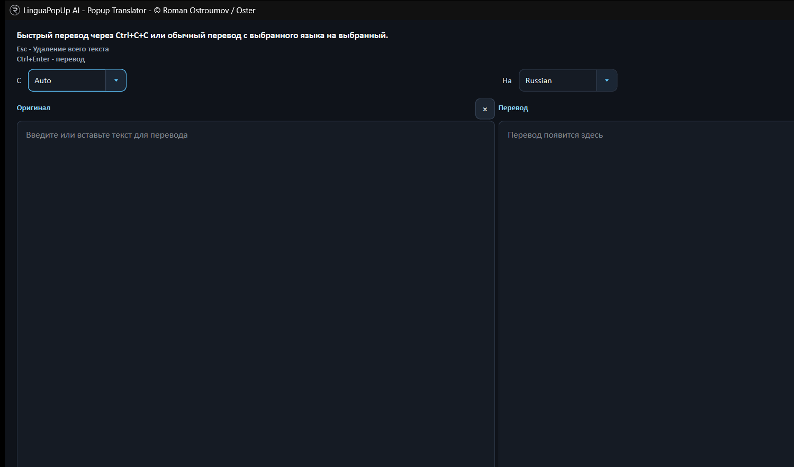

# LinguaPopUp AI

Fast popup translation for selected text on Windows and macOS.

LinguaPopUp AI helps you translate text without breaking your workflow: select text anywhere, press the shortcut, and get a quick translation popup. It automatically translates selected text into your chosen target language, including mixed-language text, while preserving the meaning as clearly as possible. You can also open the main translator window for normal manual translation, choose your preferred target language, and keep local translation history on your computer.

  

## Download

Choose the installer for your system:

- **Windows:** [LinguaPopUp AI v2.0.1](https://github.com/0sterman/AI-LinguaFlow/releases/tag/v2.0.1)
- **macOS Intel:** current macOS build remains v1.0.9 while the Windows v2 line is being updated.

## Shortcuts

- **Windows popup translation:** `Ctrl+C+C`
- **macOS popup translation:** `Cmd (Ctrl)+C+C`
- **Clear text:** `Esc`
- **Translate in the main window:** `Ctrl+Enter` on Windows, `Cmd (Ctrl)+Enter` on macOS

## What It Supports

- Popup translation for selected text
- Automatic translation into the selected target language
- Mixed-language text translation with meaning preservation
- Manual translation in the main app window
- Local translation history
- Configurable primary language
- OpenAI, Google Gemini, and Anthropic Claude providers

## API Key Required

LinguaPopUp AI does not include a shared translation API key.

After installation, enter your own API key for the selected provider in:

`Settings -> API`

## API Key Storage

Your API key is stored locally on your computer. LinguaPopUp AI uses the system key storage through `keyring`:

- **Windows:** Windows Credential Manager
- **macOS:** the system keychain/keyring available to the app

The key is saved under the local service entry used by the app and is not included in the installer, not published in this repository, and not shared with other users.

If no saved key is found, LinguaPopUp AI can also read provider keys from environment variables:

- `OPENAI_API_KEY`
- `GEMINI_API_KEY` or `GOOGLE_API_KEY`
- `ANTHROPIC_API_KEY`

Usage help is available inside the app in:

`Settings -> General -> Guide`

## Privacy

Your settings and translation history are stored locally on your computer. Text is sent only to the AI provider you choose for the current translation request.

## Source Code

This public repository is only for downloads and product information. The LinguaPopUp AI source code is private and proprietary.

Copyright (c) Roman Ostroumov / Oster. Copying, redistribution, reverse engineering, or modification is not permitted without written permission from Roman Ostroumov / Oster.
